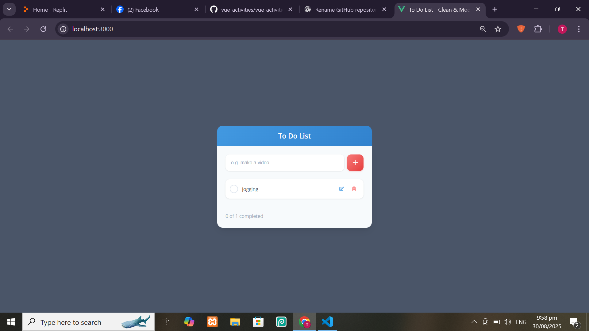

## Act-2-Vuejs_ToDoList

A simple Vue 3 project that demonstrates creating, editing, completing, and deleting tasks in a To Do List application.

## Features

- ➕ Add new tasks

- 📝 Edit existing tasks

- ✅ Mark tasks as completed

- 🗑️ Delete tasks

- 📊 Track progress of completed vs. active tasks

## Installation & Setup
1. Clone the repository:
   ```bash
   git clone https://github.com/secre-alt/vue-activities.git
   cd activity-2/TodoList

2. Install dependencies:
    ```bash
    npm install
3. Run the development server:
    ```bash
    npm run dev
4. Open your browser at:
    ```bash
    http://localhost:3000/

## ScreenShot
