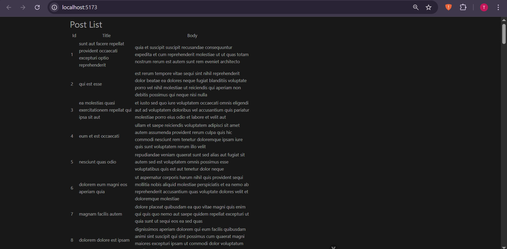

# Act-3-Vuejs_Axios


A simple Vue 3 project that demonstrates fetching and displaying data using **Axios** from the [JSONPlaceholder API](https://jsonplaceholder.typicode.com/).

## Features
- 📌 Built with Vue 3 Composition API  
- 📡 Uses Axios to fetch posts data  
- 🖥️ Displays posts in a table format (ID, Title, Body)  
- ⚡ Handles loading and error states  


## Installation & Setup
1. Clone the repository:
   ```bash
   git clone https://github.com/secre-alt/vue-activities.git
   cd activity-3/PostList

2. Install dependencies:
    ```bash
    npm install
3. Run the development server:
    ```bash
    npm run dev
4. Open your browser at:
    ```bash
    http://localhost:5173/

## ScreenShot


## Tech Stack
- [Vue 3](https://vuejs.org/)
- [Axios](https://axios-http.com/)
- [Vite](https://vitejs.dev/)
